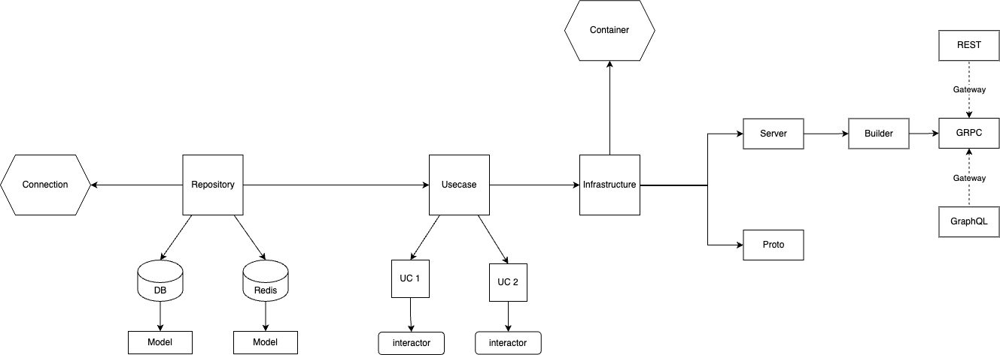

##Project Structure

### Layer Explanation 

Have 3 main layer
1. Repository Layer
2. Usecase Layer
3. Infrastructure Layer

#### repository layer

- representation of database, cache, third-party, etc
- can create a model for send and retrieve data inside every repository

#### usecase layer

- representation of feature
- example: oauth usecase, transaction usecase
- at least have 2 files: interaction & port
- interaction use for business logic, manipulation request and response
- in this layer, there is container file for initialize dependency injection for usecase layer

#### infrastructure layer

- infrastructure acts as an exit that will be accessed by the front end
- output can be a grpc, rest, graphql, consumer, scheduler, and many more
- there is a builder which will adjust the data for the chosen output
- will be validate the request before call interaction

** in this example is using grpc as the output. I suggest if you need more than one output, add the output server inside server folder and run simultaneously or create a gateway

### General Rules

- every layer must be stand-alone 
- naming convention is important
- you can see the implementation in [here](https://github.com/evenyosua18/auth2)